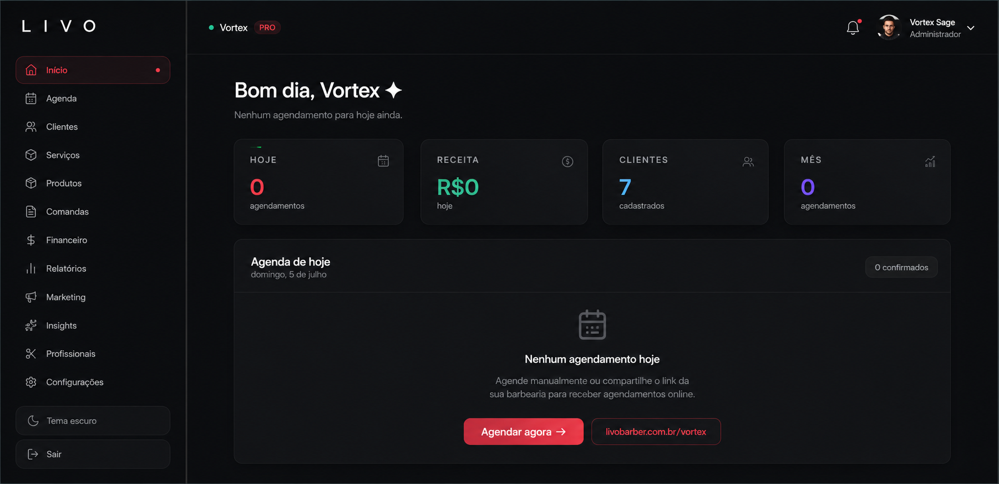
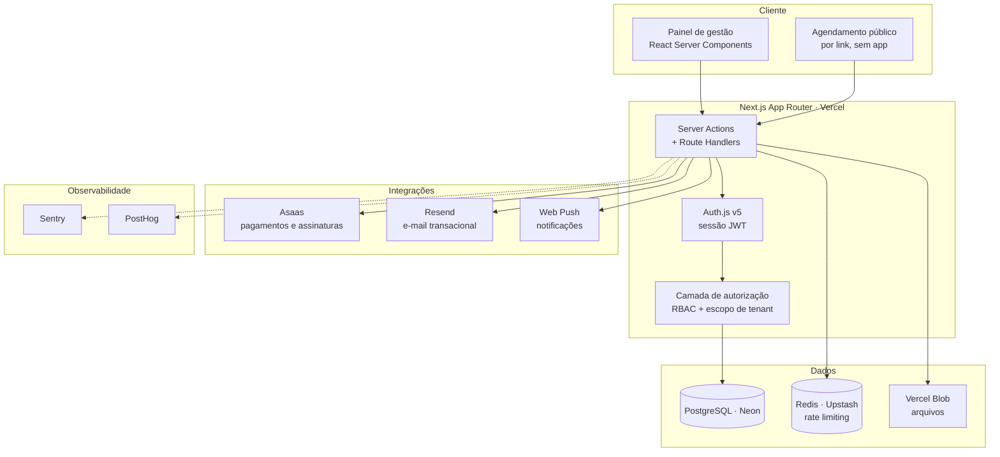

<h1 align="center">LIVO</h1>

<p align="center">
  <strong>SaaS multi-tenant de gestão para barbearias</strong><br>
  Agenda, comanda, CRM, estoque, financeiro e planos de assinatura em uma única plataforma.
</p>

<p align="center">
  <a href="https://livobarber.com.br"><strong>Ver em produção →</strong></a>
</p>

<p align="center">
  
  
  
  
  
</p>

<!-- [PRINT] Substitua a linha abaixo por um GIF ou screenshot do dashboard em uso.
     Coloque o arquivo em /docs/preview.gif e referencie assim: -->
<p align="center">
  
</p>

---

## O problema

Barbearias de pequeno e médio porte operam com agenda em caderno ou WhatsApp, comissão calculada na calculadora no fim do mês e nenhuma visibilidade de caixa. As plataformas existentes no mercado resolvem parte disso, mas exigem contrato de fidelidade, cobram multa de cancelamento e obrigam o cliente final a baixar um aplicativo para agendar.

O LIVO nasceu para cobrir a operação inteira — agendamento, atendimento, estoque e financeiro — com agendamento por link, sem app obrigatório e sem fidelidade.

## Status

Em produção em [livobarber.com.br](https://livobarber.com.br). Desenvolvido e mantido individualmente, do levantamento do problema até a infraestrutura.

|                                     |                                          |
| ----------------------------------- | ---------------------------------------- |
| Modelos de dados                    | 43                                       |
| Telas                               | 43                                       |
| Perfis de acesso                    | 3 (proprietário, recepção, profissional) |
| Verticais sobre a mesma arquitetura | 2 (Barber e Beauty)                      |

---

## Arquitetura



Toda leitura e escrita passa pela camada de autorização antes de chegar ao banco. Não há caminho que alcance o Prisma sem passar por validação de sessão, papel e tenant.

---

## Decisões técnicas

Esta é a seção que mais diz sobre o projeto. Cada decisão abaixo resolveu um problema concreto que apareceu durante o desenvolvimento.

### Isolamento multi-tenant por linha, validado nos dois sentidos

Todo registro carrega o identificador do estabelecimento, e o filtro é aplicado **tanto na leitura quanto na escrita**. A validação na escrita é o ponto que costuma ser esquecido: filtrar apenas a consulta protege contra vazamento de dados, mas não impede que uma requisição forjada altere o registro de outro tenant.

Durante uma revisão do próprio código, encontrei exatamente esse caso — uma rota de escrita sem o filtro de escopo — e corrigi. Foi o que me levou a padronizar a validação nos dois sentidos, em vez de tratá-la caso a caso.

**Alternativa descartada:** um banco por tenant. Resolveria o isolamento por construção, mas multiplicaria o custo de migração e de infraestrutura por cliente — inviável para um produto vendido a partir de R$ 59,90/mês.

### Comissão modelada como conta a pagar, não como saída de caixa

O primeiro modelo tratava a comissão do profissional como uma despesa lançada no momento do atendimento. Isso produzia um relatório financeiro errado: o caixa aparecia reduzido por um valor que ainda não tinha saído, e o dono via um saldo que não correspondia ao dinheiro real.

A comissão passou a ser um **passivo** — ela é gerada no atendimento, mas só afeta o caixa quando o pagamento ao profissional é efetivamente confirmado. O sistema suporta dois modos de liquidação, parcial e total, com conciliação automática.

**Aprendizado:** modelar o domínio financeiro exige entender contabilidade básica antes de escrever a primeira migration. Refatorar isso depois custa caro porque dados históricos já foram gravados no formato errado.

### Precisão decimal exata em todo o pipeline monetário

Valores monetários trafegam como string decimal e são convertidos apenas nas fronteiras. Ponto flutuante em preço, desconto e comissão acumula erro de arredondamento que, num relatório de fechamento mensal, aparece como centavos que ninguém consegue explicar — e, num sistema financeiro, um centavo inexplicável destrói a confiança do usuário no produto inteiro.

### Notificações push sem custo adicional de infraestrutura

Profissionais precisam saber de um novo agendamento em tempo real. A solução natural seria WebSocket ou um serviço gerenciado de push, mas ambos adicionam custo fixo mensal a um produto que ainda está validando receita.

Implementei com **Web Push nativo**, contornando o limite de execução de cron do plano de hospedagem através de um disparador externo com intervalo curto. Entrega em tempo real percebido, custo marginal zero.

**Trade-off assumido:** latência de até alguns minutos em vez de instantânea. Aceitável para o caso de uso — e revisável quando a receita justificar a troca.

### Guardrails no processo de build

Não há pipeline de CI neste repositório ainda. Em vez disso, verificações rodam dentro do próprio script de build, antes do `next build`: comparação de diff de migrations, checagem de compatibilidade do Prisma com o runtime edge e validação de caracteres. Impede que um build quebrado chegue à Vercel.

**Limitação reconhecida:** é uma solução de contorno, não substitui CI. Migrar para GitHub Actions está no backlog.

---

## Stack

| Camada              | Tecnologias                                                   |
| ------------------- | ------------------------------------------------------------- |
| **Framework**       | Next.js (App Router, React Server Components), TypeScript     |
| **UI**              | Tailwind CSS, shadcn/ui, Radix UI, Framer Motion, dnd-kit     |
| **Autenticação**    | Auth.js v5 (credenciais + OAuth Google), sessão JWT, bcryptjs |
| **Autorização**     | RBAC com 3 papéis, escopo de tenant por linha                 |
| **Banco de dados**  | PostgreSQL (Neon), Prisma ORM, migrations versionadas         |
| **Cache e limites** | Redis (Upstash), rate limiting por rota sensível              |
| **Integrações**     | Asaas (pagamentos e assinaturas), Resend (e-mail), Web Push   |
| **Arquivos**        | Vercel Blob                                                   |
| **Testes**          | Vitest (unitário e integração), Playwright (end-to-end)       |
| **Qualidade**       | Biome (lint e formatação), TypeScript strict                  |
| **Observabilidade** | Sentry (erros), PostHog (produto)                             |
| **Infraestrutura**  | Vercel, PWA instalável                                        |

---

## Módulos

- **Agenda** — agendamento por profissional, bloqueios, encaixes e agendamento público por link
- **Comanda** — atendimento em aberto, adição de serviços e produtos, fechamento com múltiplas formas de pagamento
- **Clientes** — cadastro, histórico de atendimentos e recorrência
- **Profissionais** — papéis, permissões e comissionamento configurável por pessoa e por tipo de serviço
- **Produtos e estoque** — cadastro, movimentação, combos e baixa automática no atendimento
- **Financeiro** — caixa, contas a pagar, comissões e conciliação
- **Assinaturas** — planos recorrentes de clientes e pacotes de serviço
- **Relatórios** — faturamento, desempenho por profissional e exportação para Excel

---

## Rodando localmente

```bash
git clone https://github.com/degasdegani/livo.git
cd livo
npm install
cp .env.example .env   # preencha as variáveis
npx prisma migrate dev
npm run dev
```

Aplicação disponível em `http://localhost:3000`.

### Variáveis de ambiente

| Variável                                              | Descrição                       |
| ----------------------------------------------------- | ------------------------------- |
| `DATABASE_URL`                                        | String de conexão do PostgreSQL |
| `AUTH_SECRET`                                         | Chave de assinatura da sessão   |
| `AUTH_GOOGLE_ID` / `AUTH_GOOGLE_SECRET`               | Credenciais do OAuth Google     |
| `RESEND_API_KEY` / `RESEND_FROM`                      | Envio de e-mail transacional    |
| `ASAAS_API_KEY`                                       | Gateway de pagamentos           |
| `UPSTASH_REDIS_REST_URL` / `UPSTASH_REDIS_REST_TOKEN` | Redis                           |

### Testes

```bash
npm run test          # Vitest
npm run test:e2e      # Playwright
```

---

## Roadmap

- [x] Módulo de agenda e comanda
- [x] Financeiro com comissões e conciliação
- [x] Estoque e combos
- [x] Assinaturas e planos recorrentes
- [x] RBAC com convites e papéis
- [ ] Pipeline de CI com GitHub Actions
- [ ] Agente de agendamento por WhatsApp

---

## Autor

**Eduardo Degani** — Desenvolvedor Full Stack
[LinkedIn](https://linkedin.com/in/eduardo-degani) · [GitHub](https://github.com/degasdegani) · contatodegani@gmail.com

O código deste repositório é de um produto comercial. Está público para fins de avaliação técnica.
